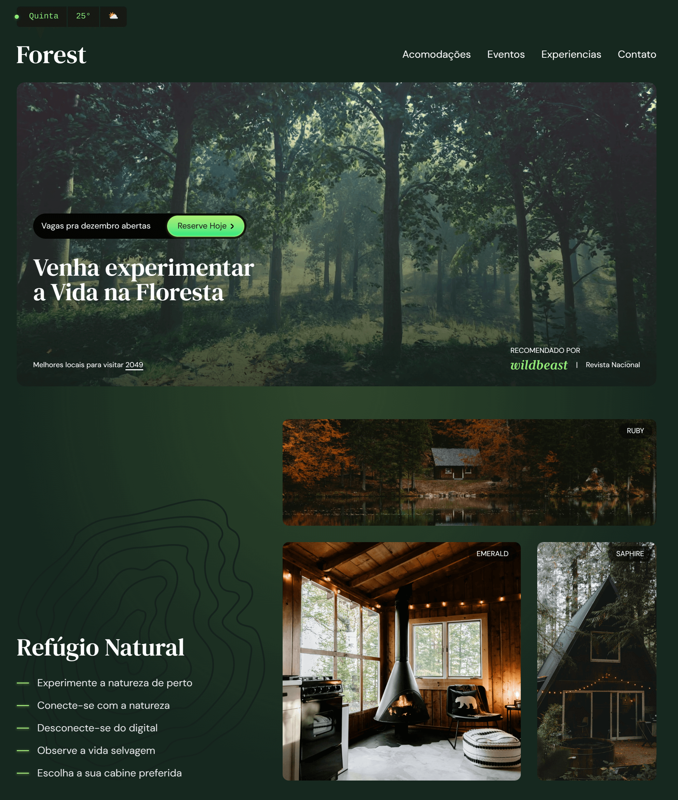

# Forest



[Forest](https://thiagodff.github.io/forest-tailwind/) is a project created for learning and experimenting with Tailwind v4.

## Technologies Used

- **Tailwind CSS v4:** CSS framework with utility-first approach.
- **Directives:** Utilizing Tailwind's `@apply`, `@layer`, `@theme`, `@utility` directives to organize and extend the CSS.
- **HTML5:** For the structural markup of the website.
- **Javascript:** To change some html content.

## Getting Started

1. **Clone the Repository:**

```bash
git clone https://github.com/thiagodff/forest-tailwind
cd forest-tailwind
```

2. **Install Dependencies:**

```bash
npm install
```

3. **Start the Development Server:**

```bash
npm run dev
```

This command will start the Tailwind CSS CLI in watch mode. It will automatically process your `input.css` file and generate the `output.css` file whenever you make changes.

4. **Open `src/index.html`:** Open the file in your browser to view the project.

## Project Structure

- **`src/`**: Contains the source files for the project.
  - **`index.html`**: The main HTML file.
  - **`input.css`**: The main Tailwind CSS entry point, where you import Tailwind and define custom styles.
  - **`output.css`**: generated css from input.css.
  - **`img/`**: contains project images and icons.

## Features

- Responsive design using Tailwind CSS utility classes.
- Custom animations and transitions.
- Dynamic content using JavaScript.

## License

This project is open-source and available under the [MIT License](LICENSE).

---

**Happy coding! 🌲**

---
